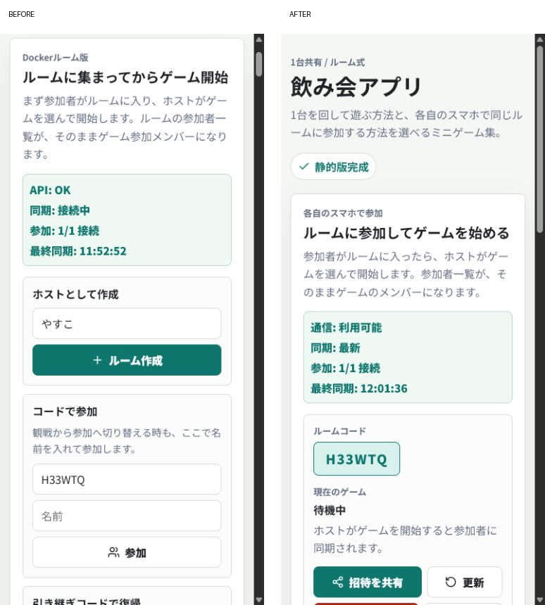
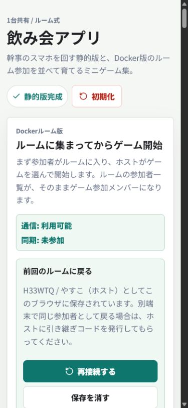
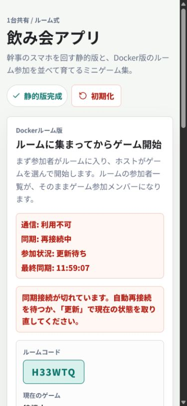

# 飲み会アプリ UX・同期監査

実施日: 2026-07-17

## 監査範囲

- スマホ幅 390 × 844
- ルーム作成
- 参加導線
- 同じ端末での一時退出と復帰
- 同期切断と自動再接続
- 画面から確認できる範囲のアクセシビリティ

ユーザーの主目的は、飲み会の最中に迷わず参加し、通信断や一時離脱があっても同じ参加者として戻り、進行中の状態を失わないこととした。

## 結論

初期状態では、ルーム作成後も4種類の参加フォームが上部に残り、現在のルームとゲーム開始がスマホで数画面下に押し込まれていた。また「この端末だけ退出」が復帰情報まで消すため、一時離脱から同じ参加者へ戻りにくかった。

改善後は、参加前と参加後の画面を分離し、参加後は現在のルームを最優先で表示する。招待リンク、一時退出後のワンタップ復帰、通信断時の操作停止と自動回復も追加した。

## フロー別監査

1. 初回入口 — 改善済み
   - 「参加・作成・別端末から復帰・観戦」を切り替える方式に変更した。
   - 同時に4フォームを見せず、選んだ目的の入力欄だけを表示する。
   - 入力欄に読み上げ可能な名前を追加した。

2. ルーム作成後の待機 — 良好
   - 参加フォームと33件のゲーム一覧を隠し、ルームコード、同期状態、現在のゲーム、招待操作を上部に表示する。
   - ルーム参加中は、復帰情報を消す「端末データを初期化」を表示しない。

3. 招待と参加 — 改善済み
   - 「招待を共有」からルームコード付きリンクを共有できる。
   - `?room=ルームコード` 付きリンクでは参加フォームへコードを自動入力する。
   - Web Share がない環境では、招待文とリンクをクリップボードへコピーする。

4. 同じ端末での一時退出と復帰 — 良好
   - 一時退出では参加者IDを端末に残す。
   - 「前回のルームに戻る」からワンタップで同じ参加者へ再接続できる。

5. 同期切断と回復 — 良好
   - 通信断を「通信: 利用不可」「同期: 再接続中」「参加状況: 更新待ち」で明示する。
   - 古い状態のままゲーム開始、進行、削除、ホスト交代を実行できないようにした。
   - サーバー復帰後は自動で「同期: 最新」へ戻ることを確認した。

6. アクセシビリティ — 部分改善
   - 入力欄へ明示的なアクセシブルネームを追加した。
   - 通信状態と成功通知に `status`、エラー通知に `alert` を付けた。
   - 主要ボタンは44px以上の操作サイズを維持している。
   - キーボードだけの全操作、スクリーンリーダー実機、200%ズーム、色覚別の見え方は追加検証が必要。

## 実装した主な改善

- 参加前と参加後の段階的表示
- 参加方法の目的別切り替え
- 招待リンク共有とルームコード自動入力
- 一時退出時の復帰情報保持
- ワンタップ再接続
- 通信断表示の整合性
- 同期断中の危険な進行操作の停止
- 技術用語を減らした案内文
- 端末データ初期化の確認と、参加中の非表示
- 入力ラベル、ライブ通知、エラー通知の改善

## 検証

- 本番ビルド: 成功
- 全33ゲームのルームライフサイクル検証: 33成功、失敗0
- ルーム作成: 成功
- 同端末の一時退出 → ワンタップ復帰: 成功
- API停止 → 切断表示 → API再開 → 自動再同期: 成功
- 日本語ファイルの実内容に文字化けなし。PowerShellの暗黙エンコーディングによる表示差だけだった。

## 証拠の限界

- 監査用ブラウザは1つの保存領域を共有するため、2台の実スマホを使った招待リンク参加と引き継ぎコード入力の画面監査は未実施。
- 引き継ぎコードの発行、使用、再使用拒否、期限・再発行関連は自動ライフサイクル検証で確認した。
- スクリーンショットだけでは WCAG 適合を断定できない。

## 残る改善候補

1. 実スマホ2台での招待リンク参加、画面ロック後の復帰、Wi-Fiとモバイル回線の切り替えを確認する。
2. 参加者が多い場合の一覧折りたたみと、ホスト向け操作の整理を行う。
3. 大きなフロントエンド配信ファイルをゲーム単位に分割し、初回表示を軽くする。
