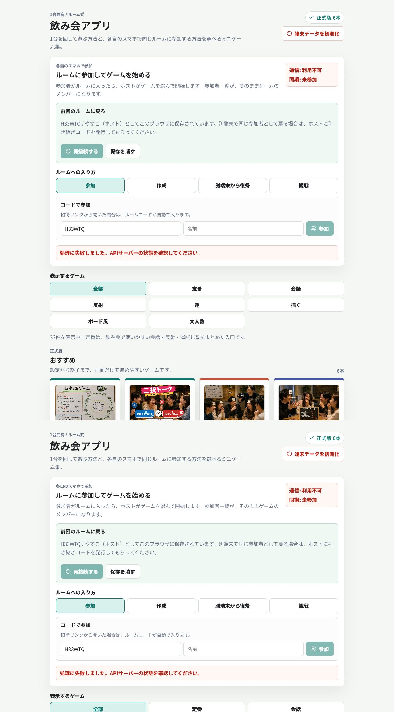

# UX・同期監査（2026-07-26）

## 監査対象

添付レビューの改善点を基準に、Lunaが実装し、Solがコード・実画面・保存復帰フローを再監査した。静的版はVite開発サーバーで確認し、ルーム実機はDocker API停止のため接続確認を分離した。

## 実施手順

1. トップ画面で、参加・作成・別端末から復帰・観戦の入口、通信状態、前回ルーム復帰を確認。
2. ゲーム一覧で正式版・ベータ・進行カードの成熟度表示を確認。
3. 抽選ゲームで、抽選前の表示、クリック後の結果表示、はずれ後の操作ロックを確認。
4. 参加者入力・削除・セグメント選択のアクセシブルネームと選択状態を確認。
5. 破損JSON、将来version、壊れた配列/union、不正日時の保存復帰を隔離実行で確認。
6. 保存失敗時にゲーム継続できること、18+設定が長期保存されないことをコードで確認。

## 結果

- P0: 0件
- P1: 0件（Sol最終再監査で確認済み）
- 抽選前のはずれ情報漏えい: 解消
- はずれ後の再抽選ロック: 解消
- 成熟度表示と実装能力の不一致: 修正
- 将来versionの上書き: 書き戻し抑止で修正
- 参加者操作のアクセシビリティ: 修正
- 非プロンプトゲームの設問数/18+設定の誤表示: 修正
- 匿名投稿の入力・一覧表示: 投稿本文をsetup画面で隠し、開封時に表示する形へ修正

Solの実画面証跡: [抽選前](<C:/Users/yas_k/.codex/visualizations/2026/07/17/019f6df9-e4e9-7443-b8e4-a722419d3ae7/sol-audit-2026-07-26/02-hazard-before-draw.png>)、[はずれ後ロック](<C:/Users/yas_k/.codex/visualizations/2026/07/17/019f6df9-e4e9-7443-b8e4-a722419d3ae7/sol-audit-2026-07-26/03-hazard-locked.png>)、[成熟度表示](<C:/Users/yas_k/.codex/visualizations/2026/07/17/019f6df9-e4e9-7443-b8e4-a722419d3ae7/sol-audit-2026-07-26/06-final-game-sections.png>)。

## 証跡

## 残る制約

- `npm run build` は成功するが、初期JavaScriptチャンクが500kBを超える警告が残る。
- Docker DesktopのAPIが停止しており、実サーバーを介したルーム参加・同期のE2E確認は実施できない。静的版の状態遷移、保存復帰、コード監査の結果とは分けて扱う。
- 保存失敗は開発者向け警告に留まるため、利用者向けのトースト通知は今後の改善候補。
- 初期JavaScriptチャンクの分割（動的読み込み）は今後の性能改善候補。
